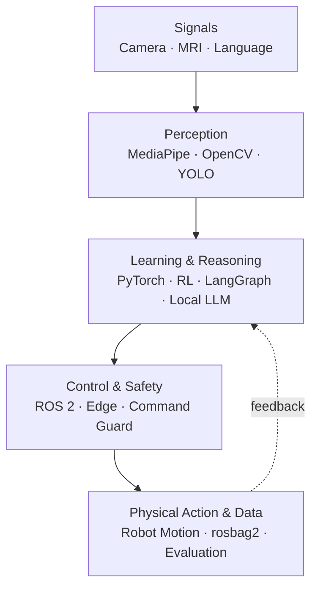
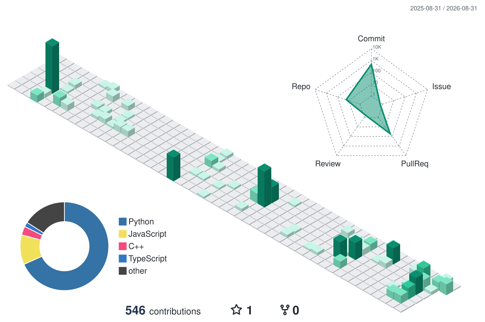

# Se Min Kong · 공세민

### Building AI that sees, reasons, and moves.

비전·에이전트·로봇 제어를 연결해 **입력부터 검증 가능한 physical action까지** 동작하는 시스템을 만듭니다.  
모델 하나보다 perception–decision–control–data가 끊기지 않는 전체 흐름에 관심이 있습니다.

---

## Sense → Reason → Act → Learn

> My work lives in the interfaces between these layers.

| Now | What I am testing |
|---|---|
| `RETARGETING` | 21개 손 landmark를 안전한 7-DoF 텐던 핸드 명령으로 바꾸는 방법 |
| `SIM-TO-REAL` | sensor noise·latency·contact dynamics의 domain gap을 비교하고 줄이는 방법 |
| `EDGE AI` | Jetson·Raspberry Pi 환경에서 latency·memory budget·observability를 함께 설계하는 방법 |

---

## Selected Systems

### 01 — THING · Human-Mimetic Robot Hand

`Hand landmarks → safe 7-axis motion → experiment data`

카메라가 읽은 21개 손 landmark를 7축 `HandCommand`로 변환하고, ROS 2 명령 중재·Command Guard·GPIO E-Stop을 거쳐 실제 텐던 로봇 핸드와 기록 파이프라인까지 연결한 팀 프로젝트입니다.

  

[Case study](https://seminkong.github.io/SeMinKong_Web/work/thing/) · [Repository](https://github.com/SeMinKong/THING) · [Full demos](https://github.com/SeMinKong/THING#시연)

| System | Input → Output | Evidence |
|---|---|---|
| [**AQIS for Smart Factory**](https://seminkong.github.io/SeMinKong_Web/work/aqis/) | RealSense·YOLO 검사 → conveyor·Dobot·dashboard | Team Lead · ROS 2 bridge · device adapters |
| [**Brain Tumor MRI Vision**](https://seminkong.github.io/SeMinKong_Web/work/brain-tumor-mri/) | MRI → classification + segmentation mask | [YOLO11 pipeline](https://github.com/SeMinKong/BrainMRISegmentation_YOLO) · mask-to-polygon preprocessing |
| [**Project Prompt Generator**](https://seminkong.github.io/SeMinKong_Web/work/project-prompt-generator/) | Idea → six parallel design conversations → implementation brief | [LangGraph state workflow](https://github.com/SeMinKong/ProjectPromptGenerator_LangGraph) · FastAPI · WebSocket |

<strong>More experiments</strong>

- [**Briefit**](https://seminkong.github.io/SeMinKong_Web/work/briefit/) — 비동기 뉴스 수집, 유사 기사 grouping, KoBART 요약 파이프라인
- [**Snake DQN**](https://github.com/SeMinKong/Snake_DQN) — CNN/feature-vector agents, Double DQN, reward redesign
- [**TSP GPU Solver**](https://github.com/SeMinKong/TSP) — PyTorch 기반 GA·SA 병렬 탐색

---

## Capability Map

| Layer | Tools |
|---|---|
| **Robotics & Edge** | ROS 2 · DYNAMIXEL · NVIDIA Jetson · Raspberry Pi · Intel RealSense |
| **Perception** | OpenCV · MediaPipe · Ultralytics YOLO · Intel RealSense |
| **Learning & Agents** | PyTorch · LangGraph · Transformers · Ollama |
| **Delivery** | Python · C++ · TypeScript · FastAPI · React · Docker · AWS |

`EXPLORING` Isaac Sim/Lab · sim-to-real · llama.cpp on edge devices

---

## Journey

- **2026 — Present** · SSAFY Robotics Track — Computer Vision, ROS 2, hardware/software integration
- **2020 — 2026** · Soongsil University — B.E. in Software, AI & Big Data convergence major

<strong>Awards & language</strong>

- IT Project Pro League — Encouragement Award, Soongsil University Spartan SW Education Center (2025)
- Software Competition — Gold Prize, Soongsil University SW
- Capstone Design Competition — Encouragement Award, Soongsil University SW
- OPIc English — IH

---

## Activity, rendered as terrain

  

Generated daily by GitHub Actions · light/dark theme aware

---

  <strong>Let's build something that can see, reason, and move.</strong>  
  <a href="https://seminkong.github.io/SeMinKong_Web/">Portfolio</a> ·
  <a href="https://github.com/SeMinKong">GitHub</a> ·
  <a href="mailto:semin1224@gmail.com">Email</a>

