<h1 align="center">공세민 · Se Min Kong</h1>

  카메라가 본 장면을 로봇의 움직임으로 옮기는 일을 좋아합니다. 
  숭실대학교 소프트웨어학부 · SSAFY Robotics Track

  <em>본 것을, 움직임으로.</em>

  <picture>
    <source media="(prefers-color-scheme: dark)" srcset="./assets/hero/sketch-dark.svg" />
    <source media="(prefers-color-scheme: light)" srcset="./assets/hero/sketch-light.svg" />
    
  </picture>

  camera → model → robot motion

  <a href="https://seminkong.github.io/SeMinKong_Web/resume/"><picture>
      <source media="(prefers-color-scheme: dark)" srcset="./assets/cta/resume-callout-airy-dark.svg" />
      <source media="(prefers-color-scheme: light)" srcset="./assets/cta/resume-callout-airy-light.svg" />
      </picture></a>
  <a href="https://seminkong.github.io/SeMinKong_Web/"><picture>
      <source media="(prefers-color-scheme: dark)" srcset="./assets/cta/web-callout-airy-dark.svg" />
      <source media="(prefers-color-scheme: light)" srcset="./assets/cta/web-callout-airy-light.svg" />
      </picture></a>
  <a href="mailto:semin1224@gmail.com"><picture>
      <source media="(prefers-color-scheme: dark)" srcset="./assets/cta/email-callout-airy-dark.svg" />
      <source media="(prefers-color-scheme: light)" srcset="./assets/cta/email-callout-airy-light.svg" />
      </picture></a>

## 기술 스택

  <strong>Robotics · Simulation</strong> 
  
  
  

  <strong>Languages</strong> 
  
  

  <strong>AI · Computer Vision</strong> 
  
  

  <strong>LLM · Backend</strong> 
  
   
  
  
  

  <strong>Platform · Collaboration</strong> 
  
  
  
  

## 프로젝트

<table>
  <tr>
    <td width="50%" valign="top">
      ROBOTICS · CONTROL
      <h3><a href="https://seminkong.github.io/SeMinKong_Web/work/thing/">THING ↗</a></h3>
      
<strong>손의 움직임을 실제 핸드로</strong>

      
손의 21개 랜드마크를 7축 명령으로 바꿔 텐던 로봇 핸드를 움직였습니다.

      
<code>ROS 2</code> · <code>Hand Tracking</code> · <code>Robot Control</code>

    </td>
    <td width="50%" valign="top">
      VISION · AUTOMATION
      <h3><a href="https://seminkong.github.io/SeMinKong_Web/work/aqis/">AQIS ↗</a></h3>
      
<strong>검사 결과를 공정 동작으로</strong>

      
RealSense와 YOLO의 검사 결과를 컨베이어, Dobot, 운영 화면까지 연결했습니다.

      
<code>YOLO</code> · <code>RealSense</code> · <code>Dobot</code>

    </td>
  </tr>
</table>

### 다른 프로젝트

| 분야 | 프로젝트 | 작업 내용 |
| :--- | :--- | :--- |
| 비전 · 의료 AI | [Brain Tumor MRI ↗](https://seminkong.github.io/SeMinKong_Web/work/brain-tumor-mri/) | YOLO11 종양 분류·분할 및 폴리곤 전처리 |
| LLM · NLP | [Project Prompt Generator ↗](https://seminkong.github.io/SeMinKong_Web/work/project-prompt-generator/) | LangGraph 기반 설계 대화 및 구현 문서 생성 |
| LLM · NLP | [Briefit ↗](https://seminkong.github.io/SeMinKong_Web/work/briefit/) | 뉴스 군집화 및 KoBART 요약 |
| 학습 · 최적화 | [Snake DQN ↗](https://github.com/SeMinKong/Snake_DQN) | 상태 표현에 따른 DQN 성능 비교 |
| 학습 · 최적화 | [TSP ↗](https://github.com/SeMinKong/TSP) | PyTorch 기반 유전 알고리즘 및 simulated annealing |

## 수상

  
  
  

## 이력

- 2026–현재 · SSAFY Robotics Track
- 2020–2026 · 숭실대학교 소프트웨어학부, AI·빅데이터 융합전공

## GitHub 기록

  

